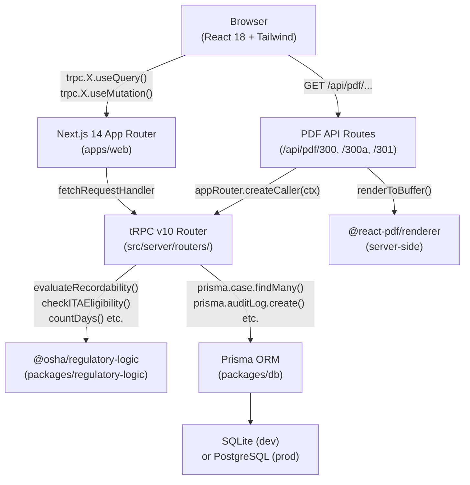
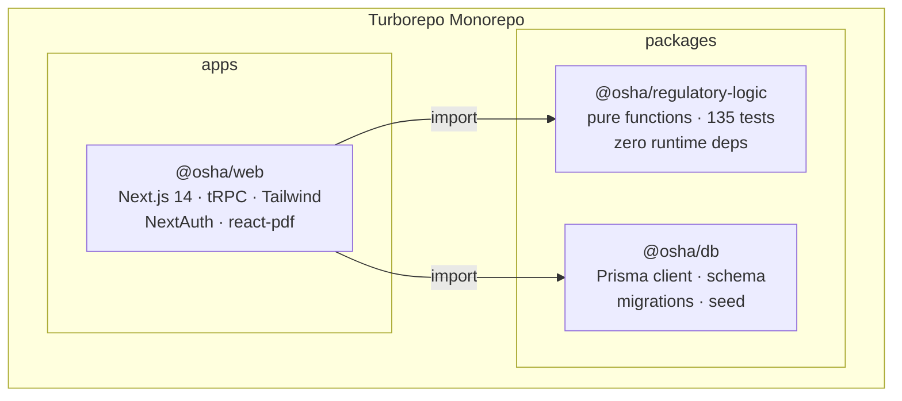
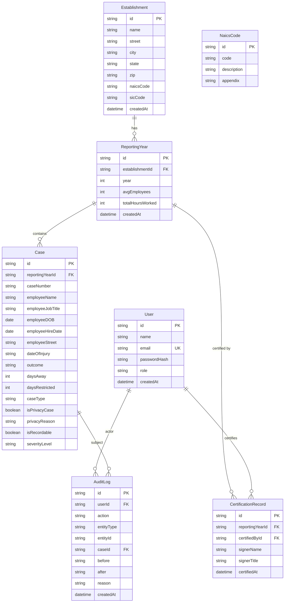

# Architecture

## System Overview

The OSHA recordkeeping system is a self-hostable monorepo built on a strict layered architecture: regulatory logic is isolated in a pure-function package with zero runtime dependencies, the database layer is schema-first with append-only audit semantics, and the web app composes both as internal workspace packages.

---

## Data Flow



---

## Package Structure



---

## Database Entity-Relationship Diagram



---

## Request Lifecycle

### Client-Side tRPC Call

1. React component calls `trpc.cases.list.useQuery({ reportingYearId })` via `@trpc/react-query`
2. `TRPCProvider` (in `src/components/providers.tsx`) sends a batched HTTP request to `/api/trpc/cases.list`
3. `fetchRequestHandler` in `src/app/api/trpc/[trpc]/route.ts` routes to the `casesRouter.list` procedure
4. The procedure authenticates via the JWT session in `createInnerTRPCContext`, then queries Prisma
5. Privacy masking is applied in `applyPrivacyMask()` before the result is serialized back
6. superjson serializes the response (preserving `Date` objects); the React component receives typed data

### Server-Side PDF Generation

1. User clicks "Download Form 300 PDF" → browser navigates to `GET /api/pdf/300/{yearId}`
2. Route handler calls `getServerSession` to verify authentication
3. Creates a tRPC caller via `appRouter.createCaller(ctx)` (bypasses HTTP, direct function call)
4. Fetches cases and establishment data through the same tRPC procedures used by the UI
5. Builds a `Form300Pdf` React-PDF document component with the fetched data
6. Calls `renderToBuffer()` to render the PDF server-side with no headless browser
7. Returns the buffer as a `application/pdf` response with `Content-Disposition: attachment`

---

## Security Architecture

### Authentication

- NextAuth v4 with Credentials provider
- Passwords stored as bcrypt hashes (prefixed `DEMO_HASH:` in seed for demo accounts)
- JWT token includes `id` and `role`; session validated on every tRPC request via `createInnerTRPCContext`

### Role Separation

| Role | tRPC Procedure Tier | Permissions |
|------|-------------------|-------------|
| ADMIN | `adminProcedure` | All operations + privacy roster + user management |
| RECORDKEEPER | `recordkeeperProcedure` | Create/edit/delete cases, manage establishments |
| REVIEWER | `protectedProcedure` | Read-only access to all data |
| EXECUTIVE | `executiveProcedure` | Certify Form 300A (1904.32(b)(3)) |

### Privacy Enforcement

Privacy masking is applied in two independent layers — defense-in-depth:

1. **`cases.ts` → `applyPrivacyMask()`**: Strips PII from `cases.list` and `cases.get` for non-ADMIN users
2. **`forms.ts` → `get300Log`**: Always substitutes "privacy case" regardless of role (300 Log is public-facing)

PII is always stored in the database. Substitution happens at render time only.

### Audit Trail

The `audit_logs` table is append-only by architectural convention:
- No `DELETE` or `UPDATE` procedures exist on `AuditLog` in any router
- `before`/`after` snapshots stored as JSON on every case update
- `reason` field required for all case mutations (1904.33 update obligations)
- `VIEW_PRIVACY` action logged whenever privacy case PII or the privacy roster is accessed

---

## Architectural Decisions

### Why Turborepo?

Regulatory logic must be independently testable — it is the highest-risk code in the system. Isolating it in `packages/regulatory-logic` with zero runtime dependencies means it can be tested with Vitest in a clean environment, imported by the web app, and potentially reused by future mobile apps or a reporting CLI without dragging in the Next.js or Prisma dependency trees.

### Why tRPC?

End-to-end type safety between the tRPC router return types and the React Query calls means that when a schema changes (e.g., a new field is added to `Case`), TypeScript reports errors at all call sites simultaneously. This is especially important for regulatory fields where a missed null-check could corrupt a form total.

### Why Prisma?

Schema-first migrations mean the database schema is the source of truth, not the application code. The `prisma/migrations/` directory provides a complete, auditable history of every schema change — critical for a system where data must be retained for 5 years.

### Why SQLite / PostgreSQL dual support?

SQLite requires zero infrastructure for development and evaluation, making the system trivially installable. The same Prisma schema works with PostgreSQL for production with only a `DATABASE_URL` change. The main constraint: Prisma enums are not supported in SQLite, so the `role` field is a plain `String` with valid values documented in code comments.

### Why @react-pdf/renderer?

The README requirement specifies "server-side PDF generation using a real PDF library, not browser print." `@react-pdf/renderer` renders React component trees to PDF buffers entirely in Node.js with no headless Chrome dependency, no browser installation, no extra Docker layer, and deterministic output. The same `StyleSheet` API familiar from React Native makes it straightforward to replicate the OSHA form layouts.

### Why soft-delete for cases?

29 CFR 1904.33 requires 5-year retention of all records and an obligation to update logs with new information. Hard-deleting a case would destroy the audit trail. Instead, `cases.delete` sets `isRecordable: false`, the row remains queryable by ADMIN users, and the audit log entry records who deleted the case and why.

---

## Development Commands

```bash
# Install all workspace dependencies
npm install --legacy-peer-deps

# Run all tests (regulatory-logic)
npm run test -w @osha/regulatory-logic

# Type-check the web app
npm run typecheck -w @osha/web

# Start the dev server
npm run dev -w @osha/web

# Build for production
npm run build -w @osha/web

# Reset and re-seed the database
cd packages/db && npx prisma migrate reset && npx ts-node --esm prisma/seed.ts
```
